# <tt>AP4FED</tt>: A Federated Learning Benchmark Platform

<p align="center">
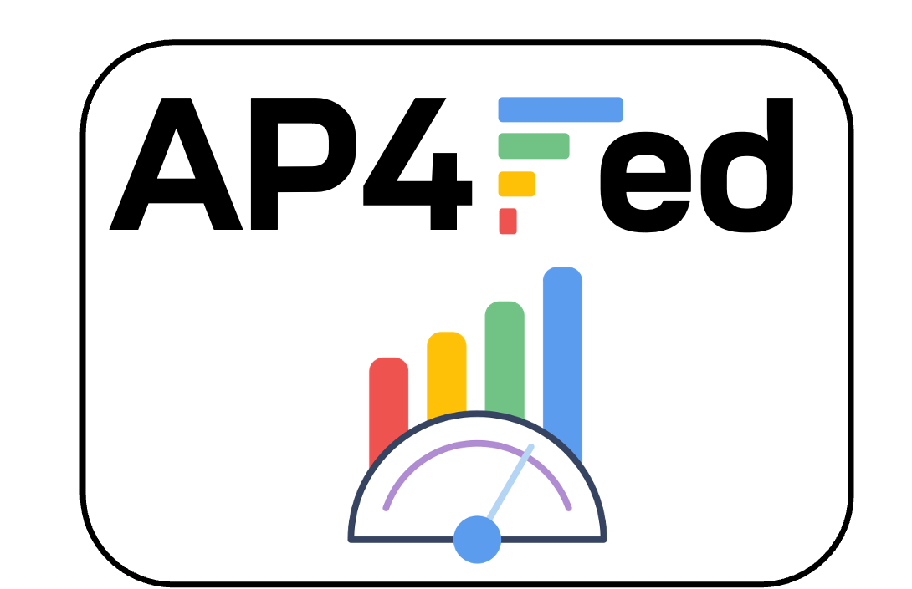
</p>

<p align="center">
  
  
  
</p>


<p align="center">
    
   
  
</p>

<tt>AP4FED</tt> is a Federated Learning benchmark platform built on top of [Flower](https://github.com/adap/flower). It helps users define, run, and compare configurable FL simulations with architectural patterns, local or Docker-based execution, and performance reporting.

The platform supports software architects and researchers in evaluating design decisions quantitatively. It can be used to study how architectural patterns affect accuracy, training time, communication time, and total round time.

<tt>AP4FED</tt> has been used in three research works:

- "_Performance Analysis of Architectural Patterns for Federated Learning Systems_", published at ICSA 2025, introduced the first version of the platform and the baseline pattern evaluation [1].
- "_Experimenting Architectural Patterns in Federated Learning Systems_", published in the Journal of Systems and Software, extended the experimental analysis to multiple architectural pattern configurations [2].
- "_Agentic Runtime Reconfiguration of Architectural Patterns in Federated Learning_", published in the Journal of Systems and Software, introduces AI-agent-based runtime reconfiguration of architectural patterns [3].

<p align="center">
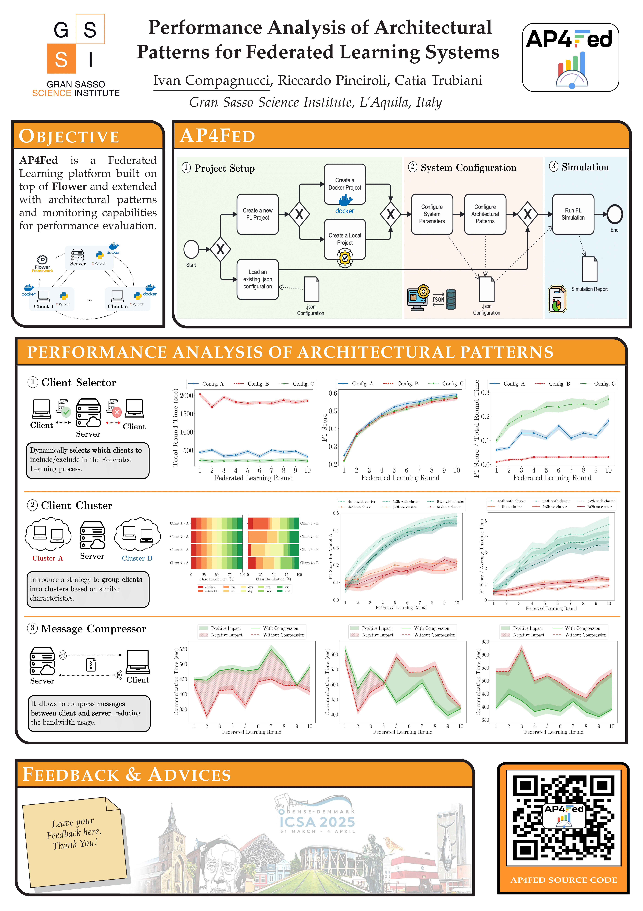
</p>

<p align="center">

</p>

# Table of contents
<!--ts-->
   * [Prerequisites](#prerequisites)
   * [How to Run](#how-to-run)
   * [Framework](#framework)
   * [Architectural Patterns](#architectural-patterns)
   * [References](#references)
   
# Prerequisites

AP4FED can run as a **Local** project or as a **Docker** project.
The local mode is enough for standard Flower simulations. Docker mode is useful when experiments need stronger client isolation and more realistic resource allocation.

## Local Project

To create a virtual environment, install dependencies, and run the tool, execute:

```bash
python3 -m venv .venv
source .venv/bin/activate
pip install -r requirements.txt
python home.py
```

## Docker Project

To run a Docker project, ensure that the following prerequisites are installed:

- [Python (version 3.12.X or higher)](https://www.python.org/downloads/) 
- [Docker](https://docs.docker.com/get-docker/)

## Headless Experiments / Cluster Runs

For paper-oriented runners and cluster executions, AP4FED provides a bootstrap flow for headless machines.
This setup runs experiments and generates CSV results without opening the GUI.

```bash
./scripts/bootstrap_experiment_env.sh
source .venv-experiments/bin/activate
python scripts/verify_experiment_env.py --mode local
```

To run Docker-backed experiments, verify the container runtime too:

```bash
python scripts/verify_experiment_env.py --mode docker
```

The full workflow is documented in [docs/HPC_EXPERIMENTS.md](docs/HPC_EXPERIMENTS.md).

The Python environment does not install or start Ollama.
LLM-based approaches (`Voting-based`, `Role-based`, `Debate-based`) call an Ollama-compatible HTTP endpoint configured through `--ollama-base-url`.


# How To Run

After installing the prerequisites, run AP4FED from the repository root:

```bash
python home.py
```

Then use the GUI to configure and run a Federated Learning simulation.

# Framework

## FL Simulation Process General Overview

<p align="center">
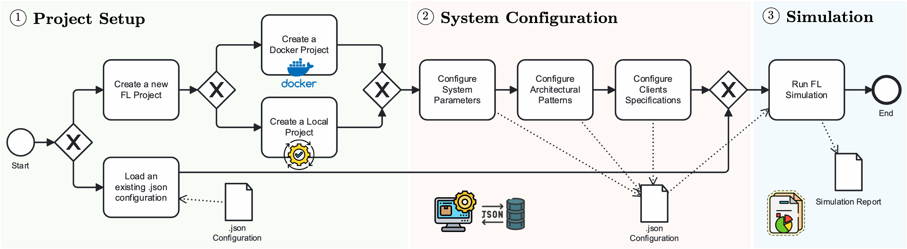
</p>

Users can choose to create a new project or load an existing JSON configuration to define system parameters, such as dataset properties, client selection criteria, and training mechanisms. For example, the Heterogeneous Data Handler allows synthetic data generation to augment client datasets and address non-IID data distributions. After configuration, the simulation process orchestrates interactions between clients and the server, tracks system metrics such as training, communication, and round times, and outputs a detailed report. This enables users to test design decisions and optimize FL system performance with ease.

## AP4FED GUI

<p align="center">
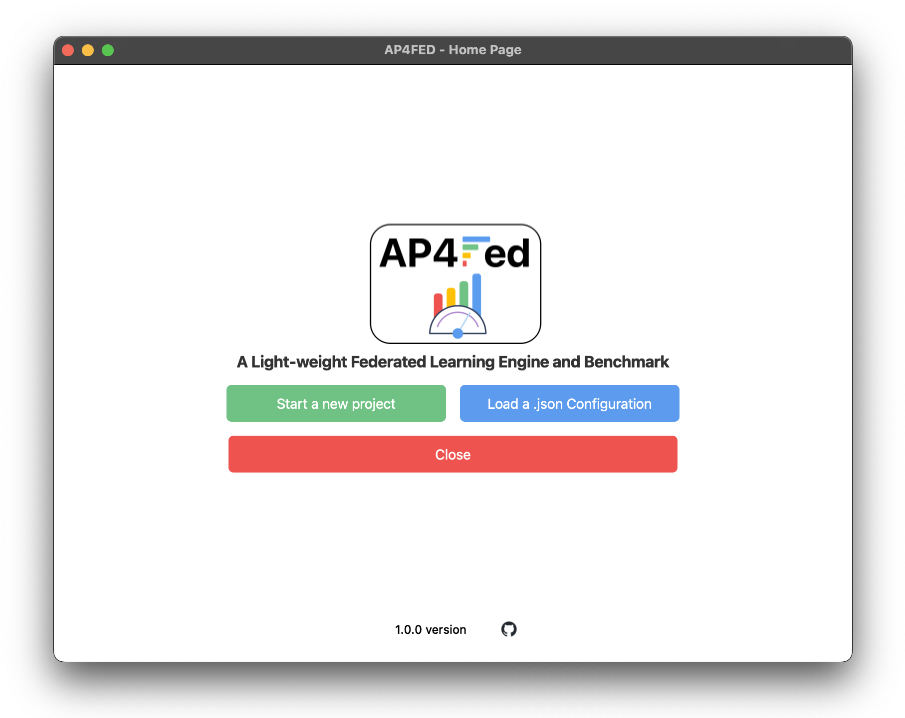
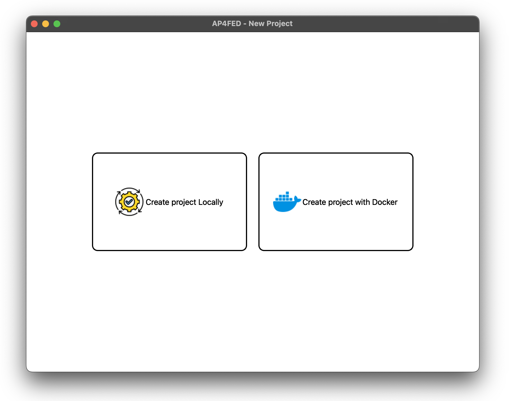
</p>

<p align="center">
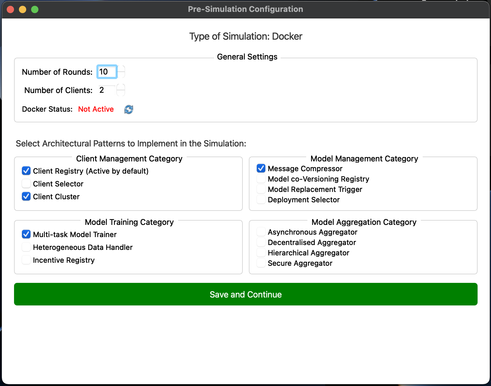
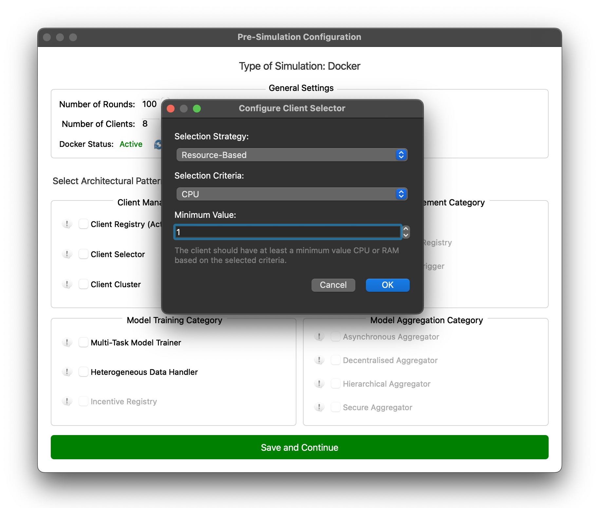
</p>

<p align="center">
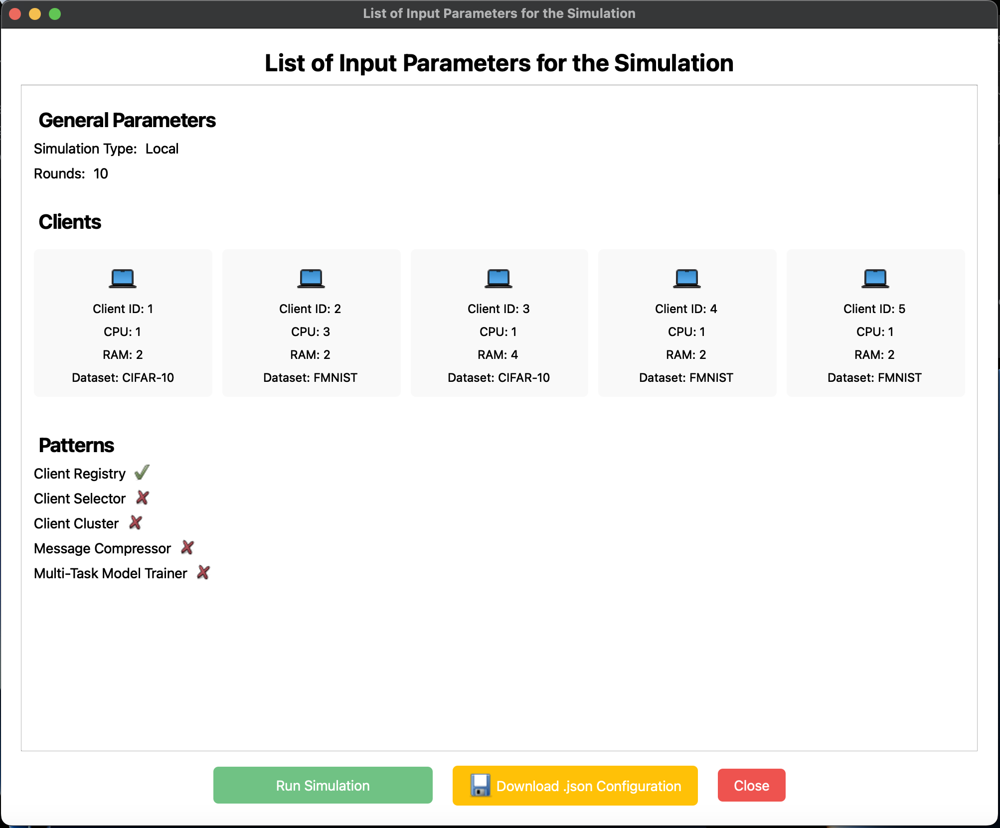
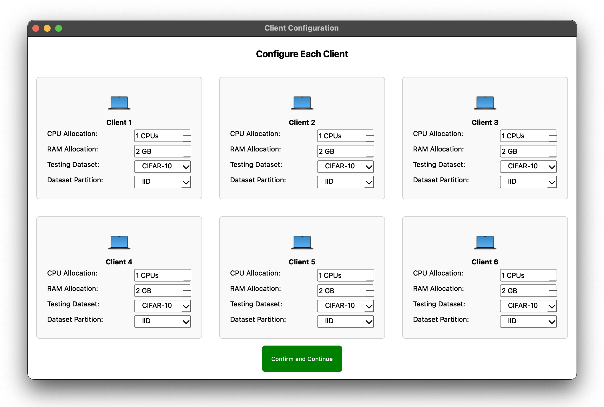
</p>

<p align="center">
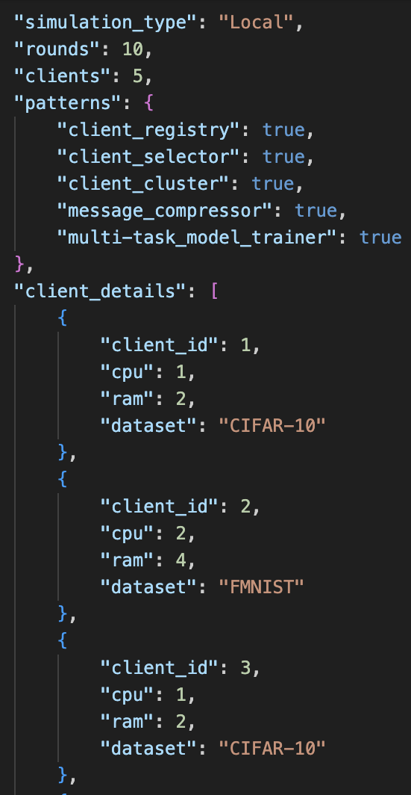
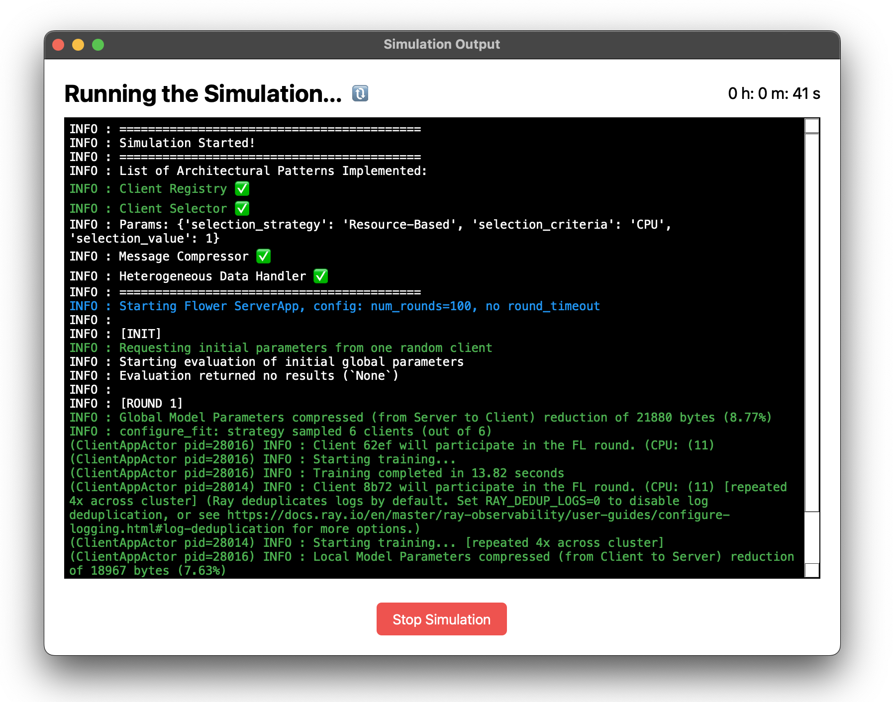
</p>

# Testing Models and Dataset

## Dataset

<tt>AP4FED</tt> supports the following datasets from the <tt>torchvision.datasets</tt> library:

- "CIFAR-10"
- "CIFAR-100"
- "FMNIST"
- "FashionMNIST"
- "KMNIST"
- "MNIST"

## Models

<tt>AP4FED</tt> supports the following models from the <tt>torchvision.models</tt> library:

- **AlexNet**
  - alexnet
- **ConvNeXt**
  - convnext_tiny
  - convnext_small
  - convnext_base
  - convnext_large
- **DenseNet**
  - densenet121
  - densenet161
  - densenet169
  - densenet201
- **EfficientNet**
  - efficientnet_b0
  - efficientnet_b1
  - efficientnet_b2
  - efficientnet_b3
  - efficientnet_b4
  - efficientnet_b5
  - efficientnet_b6
  - efficientnet_b7
- **EfficientNet V2**
  - efficientnet_v2_s
  - efficientnet_v2_m
  - efficientnet_v2_l
- **GoogLeNet / Inception**
  - googlenet
  - inception_v3
- **MnasNet**
  - mnasnet0_5
  - mnasnet0_75
  - mnasnet1_0
  - mnasnet1_3
- **MobileNet**
  - mobilenet_v2
  - mobilenet_v3_large
  - mobilenet_v3_small
- **RegNet X**
  - regnet_x_400mf
  - regnet_x_800mf
  - regnet_x_1_6gf
  - regnet_x_3_2gf
  - regnet_x_8gf
  - regnet_x_16gf
  - regnet_x_32gf
- **RegNet Y**
  - regnet_y_400mf
  - regnet_y_800mf
  - regnet_y_1_6gf
  - regnet_y_3_2gf
  - regnet_y_8gf
  - regnet_y_16gf
  - regnet_y_32gf
- **ResNet**
  - resnet18
  - resnet34
  - resnet50
  - resnet101
  - resnet152
- **ResNeXt**
  - resnext50_32x4d
- **ShuffleNet**
  - shufflenet_v2_x0_5
  - shufflenet_v2_x1_0
- **SqueezeNet**
  - squeezenet1_0
  - squeezenet1_1
- **VGG**
  - vgg11
  - vgg11_bn
  - vgg13
  - vgg13_bn
  - vgg16
  - vgg16_bn
  - vgg19
  - vgg19_bn
- **Wide ResNet**
  - wide_resnet50_2
  - wide_resnet101_2
- **Swin Transformer**
  - swin_t
  - swin_s
  - swin_b
- **Vision Transformer (ViT)**
  - vit_b_16
  - vit_b_32
  - vit_l_16
  - vit_l_32

In addition, AP4FED includes three simple Convolutional Neural Networks for testing:

| Parameter       | Model CNN 16k               | Model CNN 64k                 | Model CNN 256k                
|-----------------|-------------------------|-------------------------|--------------------------|
| `Conv. 1`      | 3 filters, 5x5 kernel    | 6 filters, 5x5 kernel    | 12 filters, 5x5 kernel    | 
| `Pool`         | Max pooling, 2x2 kernel  | Max pooling, 2x2 kernel  | Max pooling, 2x2 kernel   |
| `Conv. 2`      | 8 filters, 5x5 kernel    | 16 filters, 5x5 kernel   | 32 filters, 5x5 kernel    |
| `FC 1`         | 60 units                | 120 units               | 240 units                | 
| `FC 2`         | 42 units                | 84 units                | 168 units                | 
| `FC 3`         | 10 units                | 20 units                | 30 units                 | 
| `Batch Size`   | 32                      | 32                      | 32                       | 
| `Learning Rate`| 0.001                   | 0.001                   | 0.001                    | 
| `Optimizer`    | SGD                     | SGD                     | SGD                      | 


# Architectural Patterns

AP4FED implements the following architectural patterns:

| Architectural Pattern | Pattern Category | Description |
| --- | --- | --- | 
| **Client Registry** | `Client Management` | A registry to store relevant information of each client device participating in Federated Learning rounds. | 
| **Client Selector** | `Client Management` | A mechanism to dynamically select clients based on specific criteria, such as data distribution, device capabilities, or network conditions, to optimize the federated learning process. | 
| **Client Cluster** | `Client Management` | A strategy to group clients into clusters based on shared characteristics, such as data similarity or device attributes, improving model accuracy and convergence in non-IID data scenarios. | 
| **Message Compressor** | `Model Management` | A component designed to reduce the size of data exchanged between clients and the server by compressing messages, which lowers communication latency and bandwidth usage in federated learning environments. |
| **Model Co-Versioning Registry** | `Model Management` | A component designed to store intermediate .pt model versions alongside global models, facilitating detailed tracking of model evolution and ensuring accountability in federated learning environments. |
| **Multi-Task Model Trainer** | `Model Training` | Allows training different global models simultaneously. |
| **Heterogeneous Data Handler** | `Model Training` | Enables pre-processing operations to enhance the quality of datasets for each client participating in the FL process. |

The **Client Registry** architectural pattern is implemented by adding the following parameters:

| Attribute | Data Type | Description |
| --- | --- | --- | 
| **cID** | `string` | Client’s Unique Identifier | 
| **cluster_Type** | `string` | Cluster associated to each Client | 
| **n_CPU** | `int` | Number of Client’s CPU | 
| **training_time** | `float` | Client’s Training Time | 
| **communication_time** | `float` | Client’s Communication Time | 
| **total_round_time** | `float` | Client’s Total Round Time | 

The open-science artifact for the ICSA 2025 study [1] is available on Zenodo:

[](https://zenodo.org/records/14539962)

The open-science artifact for the Journal of Systems and Software study on multiple architectural pattern configurations [2] is available on Zenodo:

[](https://zenodo.org/records/14938910)

The open-science artifact for the Journal of Systems and Software study on agentic runtime reconfiguration [3] is available on Zenodo:

[](https://zenodo.org/records/20006358)

# References

[1] Compagnucci, I., Pinciroli, R., & Trubiani, C. (2025). [**Performance Analysis of Architectural Patterns for Federated Learning Systems.**](https://doi.org/10.1109/ICSA65012.2025.00036) 22nd IEEE International Conference on Software Architecture (ICSA 2025).

This paper introduces the first version of AP4FED and evaluates individual architectural patterns for Federated Learning systems.

```bibtex
@inproceedings{CompagnucciFL,
  author    = {Compagnucci, Ivan and Pinciroli, Riccardo and Trubiani, Catia},
  title     = {{Performance Analysis of Architectural Patterns for Federated Learning Systems}},
  booktitle = {International Conference on Software Architecture, {ICSA 25}},
  pages     = {289--300},
  publisher = {{IEEE}},
  year      = {2025},
  doi       = {10.1109/ICSA65012.2025.00036},
  url       = {https://doi.org/10.1109/ICSA65012.2025.00036}
}
```

[2] Compagnucci, I., Pinciroli, R., & Trubiani, C. (2026). [**Experimenting Architectural Patterns in Federated Learning Systems.**](https://doi.org/10.1016/j.jss.2025.112655) Journal of Systems and Software, 232, 112655.

This paper extends the experimental evaluation of AP4FED to combinations of architectural patterns and analyzes their impact on FL performance metrics.

```bibtex
@article{COMPAGNUCCI2026112655,
  author  = {Ivan Compagnucci and Riccardo Pinciroli and Catia Trubiani},
  title   = {Experimenting Architectural Patterns in Federated Learning Systems},
  journal = {Journal of Systems and Software},
  volume  = {232},
  pages   = {112655},
  year    = {2026},
  issn    = {0164-1212},
  doi     = {10.1016/j.jss.2025.112655},
  url     = {https://www.sciencedirect.com/science/article/pii/S0164121225003243}
}
```

[3] Compagnucci, I., Lu, Q., & Trubiani, C. (2026). [**Agentic Runtime Reconfiguration of Architectural Patterns in Federated Learning.**](https://doi.org/10.1016/j.jss.2026.112966) Journal of Systems and Software, 240, 112966.

This paper introduces AI-agent-based runtime reconfiguration for AP4FED, including single-agent and multi-agent strategies for adapting architectural patterns during FL execution.

```bibtex
@article{COMPAGNUCCI2026112966,
  author  = {Ivan Compagnucci and Qinghua Lu and Catia Trubiani},
  title   = {Agentic Runtime Reconfiguration of Architectural Patterns in Federated Learning},
  journal = {Journal of Systems and Software},
  volume  = {240},
  pages   = {112966},
  year    = {2026},
  issn    = {0164-1212},
  doi     = {10.1016/j.jss.2026.112966},
  url     = {https://www.sciencedirect.com/science/article/pii/S0164121226001998}
}
```
