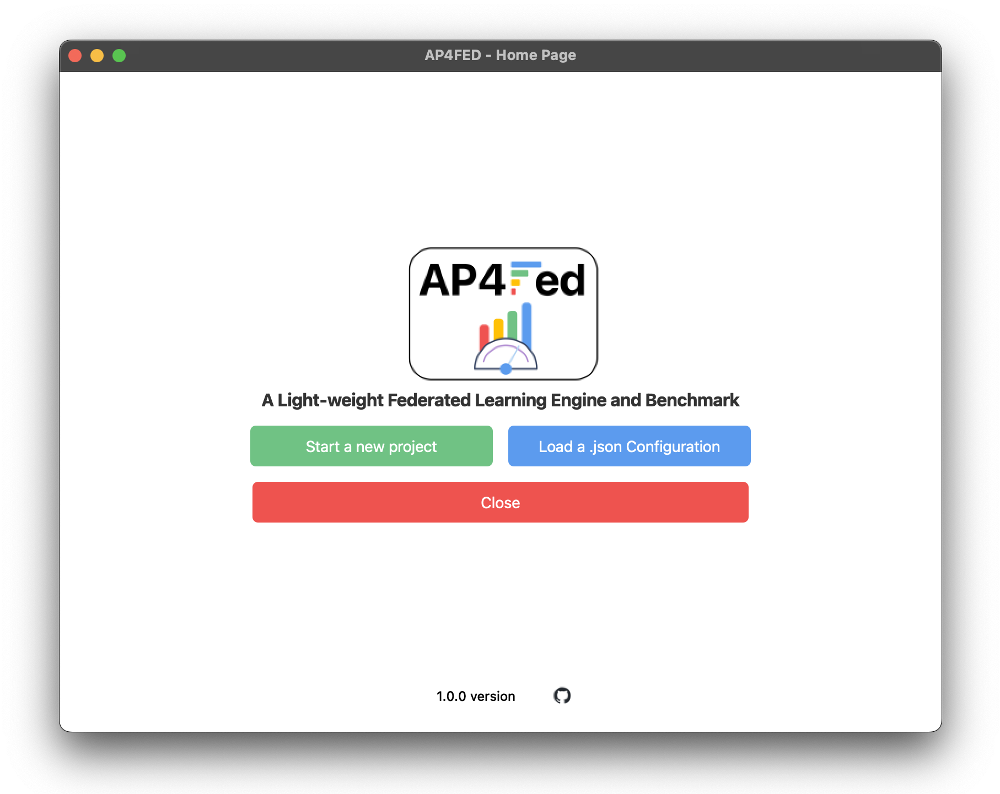
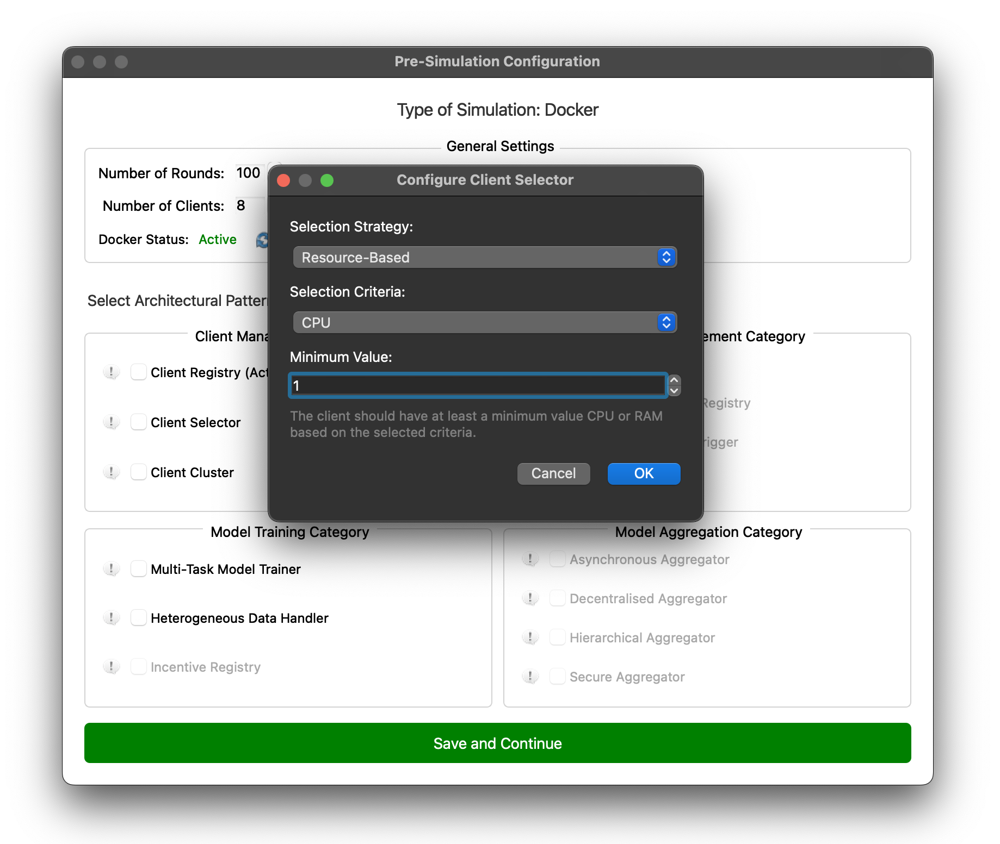

# AP4FED

<p align="center">

</p>


[](https://github.com/IvanComp/AP4Fed)

<tt>AP4FED</tt> is a Federated Learning Benchmark platform built on top of the [Flower](https://github.com/adap/flower) an open-source Python library that simplifies building Federated Learning systems. It enables the definition of customized Federated Learning system configurations by leveraging architectural patterns [2], aiming to extract and analyze system performance metrics.

<tt>AP4FED</tt> supports software architects by offering a framework for the quantitative evaluation of specific design decisions, enabling a deeper understanding of their impact on system performance and guiding the optimization of Federated Learning architectures.

<tt>AP4FED</tt> was utilized in the paper "_Performance Analysis of Architectural Patterns for Federated Learning Systems_" accepted for the 22nd IEEE International Conference on Software Architecture (ICSA 2025) [1].

You can explore use cases and performance testing of architectural patterns using <tt>AP4FED</tt> in the following Zenodo repository: 

[](https://zenodo.org/records/14539962)

# Table of contents
<!--ts-->
   * [Prerequisites](#prerequisites)
   * [How to Run](#how-to-run)
   * [Framework](#framework)
   * [Architectural Patterns](#architectural-patterns)
   * [References](#references)
   
# Prerequisites

- [Python (version 3.9.X or higher)](https://www.python.org/downloads/) 
- [Docker](https://docs.docker.com/get-docker/)
- [Docker Compose (version v2.29.2 or higher)](https://docs.docker.com/compose/install/)

Docker and Docker Compose are not strictly required to run Federated Learning projects, but they are valuable tools for configurations that emulate real clients, particularly by distributing physical resources such as CPUs while avoiding CPU overcommitment. The framework allows flexibility between running a fully containerized setup or opting for a local simulation, depending on the project’s requirements and the desired level of fidelity in emulating a distributed system.

- **Docker**: Required to create and run containers.
- **Docker Compose**: Enables running multi-container applications with Docker using the `docker-compose.yml` file.

You can verify the installation with the following commands:
```bash
docker --version
docker compose version
```

# How To Run

In the main folder run the following command:

```bash
python home.py
```
Follow the instructions in the command, which will launch the <tt>AP4FED</tt>. This interface allows you to configure the Federated Learning system and proceed with benchmarking, providing a user-friendly way to manage and test the setup (Please see the next [Section](#ap4fed))

# AP4FED

<p align="center">


</p>

<p align="center">


</p>

<p align="center">


</p>

## Load/Save a Custom Configuration

<p align="center">

</p>

# Architectural Patterns

The Architectural Patterns ([2]) implemented in our framework are:

| Architectural Pattern | Pattern Category | Description |
| --- | --- | --- | 
| **Client Registry** | `Client Management` | A registry to store relevant information of each client device participating in Federated Learning rounds. | 
| **Client Selector** | `Client Management` | A mechanism to dynamically select clients based on specific criteria, such as data distribution, device capabilities, or network conditions, to optimize the federated learning process. | 
| **Client Cluster** | `Client Management` | A strategy to group clients into clusters based on shared characteristics, such as data similarity or device attributes, improving model accuracy and convergence in non-IID data scenarios. | 
| **Message Compressor** | `Model Management` | A component designed to reduce the size of data exchanged between clients and the server by compressing messages, which lowers communication latency and bandwidth usage in federated learning environments. |
| **Multi-Task Model Trainer** | `Model Training` | Allow to train different global models simultaneously |
| **Heterogeneous Data Handler** | `Model Training` | Enables pre-processing operations to enhance the quality of datasets for each client participating in the FL process. |

The **Client Registry** architectural pattern is implemented by adding the following parameters:

| Attribute | Data Type | Description |
| --- | --- | --- | 
| **cID** | `string` | Client’s Unique Identifier | 
| **cluster_Type** | `string` | Cluster associated to each Client | 
| **n_CPU** | `int` | Number of Client’s CPU | 
| **training_time** | `float` | Client’s Training Time | 
| **communication_time** | `float` | Client’s Communication Time | 
| **total_round_time** | `float` | Client’s Total Round Time | 

# References

[1] Compagnucci, I., Pinciroli, R., & Trubiani, C. (2025). **Performance Analysis of Architectural Patterns for Federated Learning Systems.**
Accepted for the 22nd IEEE International Conference on Software Architecture. ICSA 2025.

[2] Sin Kit Lo, Qinghua Lu, Liming Zhu, Hye-Young Paik, Xiwei Xu, Chen Wang,
**Architectural patterns for the design of federated learning systems**,
Journal of Systems and Software, Volume 191, 2022, 111357.
