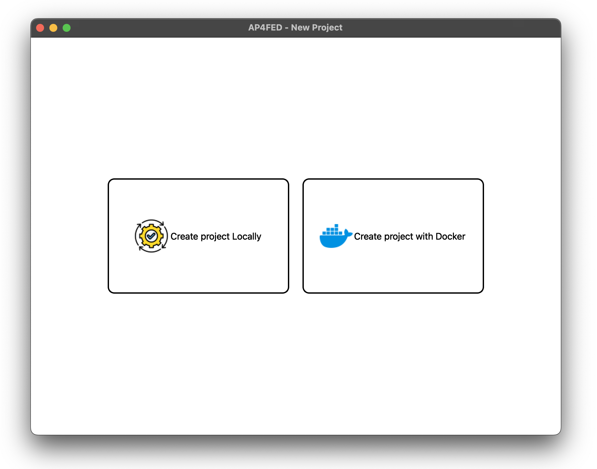
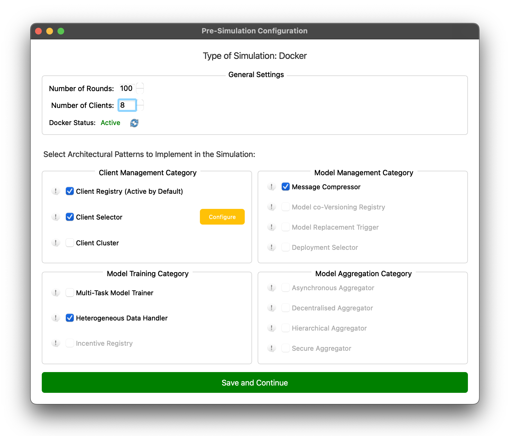
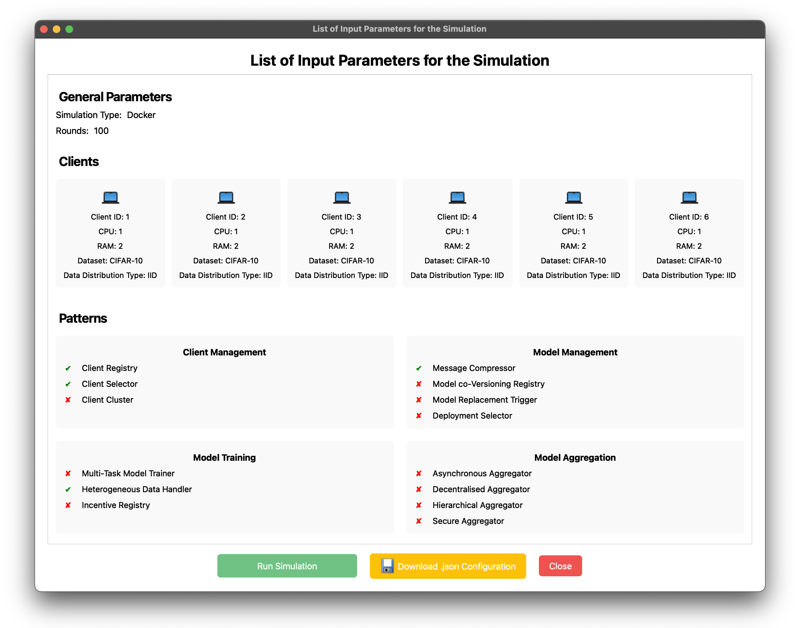

# AP4FED

<p align="center">

</p>

<p align="center">
  
  
  
</p>


<p align="center">
    
   
  
</p>

<tt>AP4FED</tt> is a Federated Learning Benchmark platform built on top of the [Flower](https://github.com/adap/flower) an open-source Python library that simplifies building Federated Learning systems. It enables the definition of customized Federated Learning system configurations by leveraging architectural patterns, aiming to extract and analyze system performance metrics.

<tt>AP4FED</tt> supports software architects by offering a framework for the quantitative evaluation of specific design decisions, enabling a deeper understanding of their impact on system performance and guiding the optimization of Federated Learning architectures.

An initial version of <tt>AP4FED</tt> was developed and tested in the research paper "_Performance Analysis of Architectural Patterns for Federated Learning Systems_" accepted for the 22nd IEEE International Conference on Software Architecture (ICSA 2025) [1].

<p align="center">

</p>

# Table of contents
<!--ts-->
   * [Prerequisites](#prerequisites)
   * [How to Run](#how-to-run)
   * [Framework](#framework)
   * [Architectural Patterns](#architectural-patterns)
   * [References](#references)
   
# Prerequisites

You can create two different types of projects: **Local** project or **Docker** project.
Docker (Docker Compose) is not required to run local Federated Learning projects, but they are valuable tools for configurations that emulate real clients, particularly by distributing physical resources such as CPUs while avoiding CPU overcommitment. The framework allows flexibility between running a fully containerized setup or opting for a local simulation, depending on the project’s requirements and the desired level of fidelity in emulating a distributed system.

## Local Project

To install all the required Python libraries and run the tool, run the following command:

```bash
pip install -r requirements.txt && python home.py
```

## Docker Project

To run a Docker Project, ensure that the following prerequisites are met:

- [Python (version 3.12.X or higher)](https://www.python.org/downloads/) 
- [Docker](https://docs.docker.com/get-docker/)


# How To Run

Please ensure that all [Prerequisites](#Prerequisites) are met before proceeding with the installation.
In the main folder run the following command:

```bash
python home.py
```

Then, follow the instructions on the GUI of <tt>AP4FED</tt> to configure and run a FL simulation. This interface allows you to configure the Federated Learning system and proceed with benchmarking, providing a user-friendly way to manage and test the setup (Please see the next [Section](#Framework))

# Framework

## FL Simulation Process General Overview

<p align="center">

</p>

Users can choose to create a new project or load an existing JSON configuration to define system parameters, such as dataset properties, client selection criteria, and training mechanisms. For example, the Heterogeneous Data Handler allows synthetic data generation to augment client datasets and address non-IID data distributions. After configuration, the simulation process orchestrates interactions between clients and the server, tracks system metrics such as training, communication, and round times, and outputs a detailed report. This enables users to test design decisions and optimize FL system performance with ease.

## AP4FED GUI

<p align="center">


</p>

<p align="center">


</p>

<p align="center">


</p>

<p align="center">


</p>

## Testing Models and Dataset

# Dataset

<tt>AP4FED</tt> supports the following dataset from the <tt>torchvision.dataset</tt> library: 

- "CIFAR-10"
- "CIFAR-100"
- "FMNIST"
- "FashionMNIST"
- "KMNIST"
- "MNIST"

# Models

<tt>AP4FED</tt> supports the following models the <tt>torchvision.models</tt> library:

- **AlexNet**
  - alexnet
- **ConvNeXt**
  - convnext_tiny
  - convnext_small
  - convnext_base
  - convnext_large
- **DenseNet**
  - densenet121
  - densenet161
  - densenet169
  - densenet201
- **EfficientNet**
  - efficientnet_b0
  - efficientnet_b1
  - efficientnet_b2
  - efficientnet_b3
  - efficientnet_b4
  - efficientnet_b5
  - efficientnet_b6
  - efficientnet_b7
- **EfficientNet V2**
  - efficientnet_v2_s
  - efficientnet_v2_m
  - efficientnet_v2_l
- **GoogLeNet / Inception**
  - googlenet
  - inception_v3
- **MnasNet**
  - mnasnet0_5
  - mnasnet0_75
  - mnasnet1_0
  - mnasnet1_3
- **MobileNet**
  - mobilenet_v2
  - mobilenet_v3_large
  - mobilenet_v3_small
- **RegNet X**
  - regnet_x_400mf
  - regnet_x_800mf
  - regnet_x_1_6gf
  - regnet_x_3_2gf
  - regnet_x_8gf
  - regnet_x_16gf
  - regnet_x_32gf
- **RegNet Y**
  - regnet_y_400mf
  - regnet_y_800mf
  - regnet_y_1_6gf
  - regnet_y_3_2gf
  - regnet_y_8gf
  - regnet_y_16gf
  - regnet_y_32gf
- **ResNet**
  - resnet18
  - resnet34
  - resnet50
  - resnet101
  - resnet152
- **ResNeXt**
  - resnext50_32x4d
- **ShuffleNet**
  - shufflenet_v2_x0_5
  - shufflenet_v2_x1_0
- **SqueezeNet**
  - squeezenet1_0
  - squeezenet1_1
- **VGG**
  - vgg11
  - vgg11_bn
  - vgg13
  - vgg13_bn
  - vgg16
  - vgg16_bn
  - vgg19
  - vgg19_bn
- **Wide ResNet**
  - wide_resnet50_2
  - wide_resnet101_2
- **Swin Transformer**
  - swin_t
  - swin_s
  - swin_b
- **Vision Transformer (ViT)**
  - vit_b_16
  - vit_b_32
  - vit_l_16
  - vit_l_32

In addition, for testing purposes, 3 Simple Convolutional Neural Networks with the following characteristics were implemented:

| Parameter       | Model CNN 16k               | Model CNN 64k                 | Model CNN 256k                
|-----------------|-------------------------|-------------------------|--------------------------|
| `Conv. 1`      | 3 filters, 5x5 kernel    | 6 filters, 5x5 kernel    | 12 filters, 5x5 kernel    | 
| `Pool`         | Max pooling, 2x2 kernel  | Max pooling, 2x2 kernel  | Max pooling, 2x2 kernel   |
| `Conv. 2`      | 8 filters, 5x5 kernel    | 16 filters, 5x5 kernel   | 32 filters, 5x5 kernel    |
| `FC 1`         | 60 units                | 120 units               | 240 units                | 
| `FC 2`         | 42 units                | 84 units                | 168 units                | 
| `FC 3`         | 10 units                | 20 units                | 30 units                 | 
| `Batch Size`   | 32                      | 32                      | 32                       | 
| `Learning Rate`| 0.001                   | 0.001                   | 0.001                    | 
| `Optimizer`    | SGD                     | SGD                     | SGD                      | 


# Architectural Patterns

The Architectural Patterns implemented in our framework are:

| Architectural Pattern | Pattern Category | Description |
| --- | --- | --- | 
| **Client Registry** | `Client Management` | A registry to store relevant information of each client device participating in Federated Learning rounds. | 
| **Client Selector** | `Client Management` | A mechanism to dynamically select clients based on specific criteria, such as data distribution, device capabilities, or network conditions, to optimize the federated learning process. | 
| **Client Cluster** | `Client Management` | A strategy to group clients into clusters based on shared characteristics, such as data similarity or device attributes, improving model accuracy and convergence in non-IID data scenarios. | 
| **Message Compressor** | `Model Management` | A component designed to reduce the size of data exchanged between clients and the server by compressing messages, which lowers communication latency and bandwidth usage in federated learning environments. |
| **Model Co-Versioning Registry** | `Model Management` | A component designed to store intermediate .pt model versions alongside global models, facilitating detailed tracking of model evolution and ensuring accountability in federated learning environments. |
| **Multi-Task Model Trainer** | `Model Training` | Allows to train different global models simultaneously |
| **Heterogeneous Data Handler** | `Model Training` | Enables pre-processing operations to enhance the quality of datasets for each client participating in the FL process. |

The **Client Registry** architectural pattern is implemented by adding the following parameters:

| Attribute | Data Type | Description |
| --- | --- | --- | 
| **cID** | `string` | Client’s Unique Identifier | 
| **cluster_Type** | `string` | Cluster associated to each Client | 
| **n_CPU** | `int` | Number of Client’s CPU | 
| **training_time** | `float` | Client’s Training Time | 
| **communication_time** | `float` | Client’s Communication Time | 
| **total_round_time** | `float` | Client’s Total Round Time | 

You can explore use cases and performance testing of architectural patterns [1] using <tt>AP4FED</tt> in the following Zenodo repository: 

[](https://zenodo.org/records/14539962)

You can explore the performance in combining **multiple** architectural patterns [2] using <tt>AP4FED</tt> in the following Zenodo repository: 

[](https://zenodo.org/records/14938910)

# References

[1] Compagnucci, I., Pinciroli, R., & Trubiani, C. (2025). [**Performance Analysis of Architectural Patterns for Federated Learning Systems.**](https://cs.gssi.it/catia.trubiani/download/2025-ICSA-Architectural-Patterns-Federated-Learning.pdf)
Accepted for the 22nd IEEE International Conference on Software Architecture. ICSA 2025.

```
@inproceedings{CompagnucciFL,
  author       = {Compagnucci, Ivan and Pinciroli, Riccardo and Trubiani, Catia},
  title        = {{Performance Analysis of Architectural Patterns for Federated Learning Systems}},
  booktitle    = {International Conference on Software Architecture, {ICSA 25}},
  pages        = {289--300},
  url          = {https://doi.org/10.1109/ICSA65012.2025.00036},
  doi          = {10.1109/ICSA65012.2025.00036}
  publisher    = {{IEEE}},
  year         = {2025},
}
```

[2] Compagnucci, I., Pinciroli, R., & Trubiani, C. (2025). **Experimenting Architectural Patterns in Federated Learning Systems.**
Accepted in The Journal of Systems & Software. 2025. (_In Press_)

```
@article{CompagnucciFLJSS,
  author       = {Compagnucci, Ivan and Pinciroli, Riccardo and Trubiani, Catia},
  title        = {{Experimenting Architectural Patterns in Federated Learning Systems}},
  journal      = {J. Syst. Softw.},
  pages        = {},
  doi          = {},
  year         = {2025},
}
```